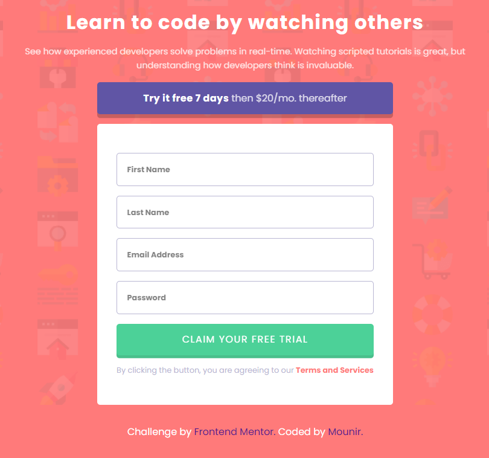

# Frontend Mentor - Intro component with sign up form solution

## Welcome! 👋

Thanks for checking out this front-end coding challenge.

[Frontend Mentor](https://www.frontendmentor.io) challenges help you improve your coding skills by building realistic projects.

This is a solution to the [Intro component with sign up form challenge on Frontend Mentor](https://www.frontendmentor.io/challenges/intro-component-with-signup-form-5cf91bd49edda32581d28fd1). Frontend Mentor challenges help you improve your coding skills by building realistic projects.

## Table of contents

- [Frontend Mentor - Intro component with sign up form solution](#frontend-mentor---intro-component-with-sign-up-form-solution)
  - [Welcome! 👋](#welcome-)
  - [Table of contents](#table-of-contents)
  - [Overview](#overview)
    - [The challenge](#the-challenge)
    - [Screenshots](#screenshots)
    - [Links](#links)
  - [My process](#my-process)
    - [Built with](#built-with)
    - [What I learned](#what-i-learned)
    - [Continued development](#continued-development)
    - [Useful resources](#useful-resources)
  - [Acknowledgments](#acknowledgments)
  - [Author](#author)

## Overview

### The challenge

Users should be able to:

- sign up

### Screenshots

 
 

 
 

### Links
- Page preview : https://intro-sign-up-form-component.netlify.app/

## My process

### Built with

- Semantic HTML5 markup
- More practice with SCSS
- Flexbox
- Form validation with javaScript ES6+
- Regular Expression

### What I learned

- I learned to use regular expressions with javascript

### Continued development

- Practice more on javascript DOM... a little more.

### Useful resources
- [@regex](https://regexr.com) :tool to test your regular expression 

## Acknowledgments 
- password validation: [@stackoverflow](https://stackoverflow.com/questions/2370015/regular-expression-for-password-validation#2370045)
## Author

- Github [@mounir-m4](https://github.com/mounir-m4)
- Twitter - [@mounirmotawakil](https://twitter.com/mounirmotawakil)
- Frontend Mentor - [@mounir-m4](https://www.frontendmentor.io/profile/mounir-m4)